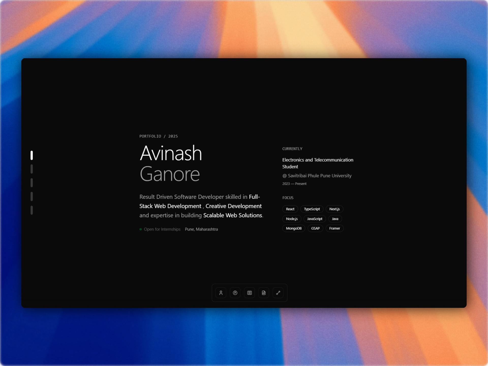

# 🌐 Personal Portfolio — Avinash Ganore

> A modern, animated developer portfolio built to showcase my projects, skills, and experience as a Full-Stack Web Developer.

🔗 **Live Site:** [avinashganore.xyz](https://www.avinashganore.xyz) &nbsp; 

---

## 📸 Preview



---

## 🚀 About

This is my personal portfolio website, designed and developed from scratch. It reflects my focus on clean UI, smooth animations, and modern web technologies. The site features my projects, blog, resume, and contact information — all in one place.

The blog section is powered by **Hashnode CMS** and fetched dynamically using **React Query**, keeping content fresh without rebuilding the site.

---

## 🛠️ Built With


---

## ✨ Features

- ⚡ **Fast & Optimized** — Built with Next.js for performance and SEO
- 🎨 **Smooth Animations** — Powered by GSAP and Framer Motion
- 📱 **Fully Responsive** — Works seamlessly across all screen sizes
- 🌙 **Clean UI/UX** — Minimal, distraction-free design
- 📝 **Blog Section** — Articles fetched dynamically from Hashnode CMS via React Query
- 📄 **Resume Viewer** — Inline resume preview and PDF download
- 📬 **Contact Section** — Easy ways to connect across platforms

---

## 📁 Projects Showcased

| Project | Type | Tech Stack |
|---|---|---|
| [Should I Bunk?](https://github.com/Xzy-Vron/bunc) | Full Stack MERN | React, Express.js, MongoDB, Node.js, Recharts |
| [Whispr](https://whispr-tau.vercel.app/) | Full Stack Next.js | Next.js, TypeScript, MongoDB, NextAuth, Resend, Shadcn |
| [CampScape](https://camp-scape.vercel.app/) | Backend | Express.js, MongoDB, Node.js, Passport, Maptiler |
| [Creative Portfolio](https://xzy-vron.github.io/creative-portfolio-demo/) | Frontend UI/UX | GSAP, JavaScript |

---

## 📝 Blog

The portfolio includes a fully integrated blog section at [avinashganore.xyz/blogs](https://www.avinashganore.xyz/blogs).

**How it works:**
- Blog content is authored and managed on **Hashnode CMS**
- Posts are fetched dynamically via the **Hashnode GraphQL API** using **React Query**
- No rebuilds needed — new posts appear automatically on the site

<!-- **UI Reference:**

| Blogs Listing Page | Single Blog Page |
|---|---|
|  |  | -->

> 💡 **Note for contributors:** Blog content is managed externally on Hashnode. To update or add posts, publish them directly on the Hashnode dashboard — they'll automatically appear on the site.

---

## 🏃 Getting Started

To run this project locally:

```bash
# Clone the repository
git clone https://github.com/Xzy-Vron/Its-Avi.git

# Navigate to the project directory
cd Its-Avi

# Install dependencies
npm install

# Start the development server
npm run dev
```

Open [http://localhost:3000](http://localhost:3000) in your browser.

---

## 📂 Project Structure

```
├── app/
│   ├── blogs/
│   │   ├── [slug]/
│   │   │   └── page.tsx        # Individual blog post page
│   │   └── page.tsx            # Blog listing page
│   ├── favicon.ico
│   ├── globals.css
│   ├── layout.tsx
│   └── page.tsx                # Home / portfolio page
├── components/
│   ├── blogs/                  # Blog-specific components
│   ├── footer/
│   ├── home/                   # Home section components
│   ├── loaders/
│   ├── sections/
│   ├── ui/
│   └── utils/
├── data/
│   ├── connect.data.ts         # Contact/social links data
│   ├── experience.data.ts      # Experience/education data
│   └── intro.data.ts           # Intro section data
├── lib/
│   ├── store/
│   ├── format-blog-date.ts     # Blog date formatter utility
│   ├── hashnode-requests.ts    # Hashnode GraphQL API queries
│   └── utils.ts
├── types/
│   └── hashnode-request.d.ts   # TypeScript types for Hashnode API
├── public/
│   ├── og.webp
│   ├── Resume.jpg
│   ├── Resume.pdf
│   └── ...
├── .env.local
├── next.config.ts
├── postcss.config.mjs
├── tailwind.config.ts
├── tsconfig.json
└── package.json
```

---

## 📬 Contact

Feel free to reach out — I'm open to internships, collaborations, and conversations about tech!

- 📧 [avinashganore@gmail.com](mailto:avinashganore@gmail.com)
- 💼 [LinkedIn](https://www.linkedin.com/in/avinash-ganore/)
- 🐙 [GitHub](https://github.com/Xzy-Vron)
- 🐦 [Twitter / X](https://x.com/XzyVron)

---

## 📄 License

This project is open source and available under the [MIT License](./LICENSE).

```
MIT License

Copyright (c) 2025 Avinash Ganore

Permission is hereby granted, free of charge, to any person obtaining a copy
of this software and associated documentation files (the "Software"), to deal
in the Software without restriction, including without limitation the rights
to use, copy, modify, merge, publish, distribute, sublicense, and/or sell
copies of the Software, and to permit persons to whom the Software is
furnished to do so, subject to the following conditions:

The above copyright notice and this permission notice shall be included in all
copies or substantial portions of the Software.

THE SOFTWARE IS PROVIDED "AS IS", WITHOUT WARRANTY OF ANY KIND, EXPRESS OR
IMPLIED, INCLUDING BUT NOT LIMITED TO THE WARRANTIES OF MERCHANTABILITY,
FITNESS FOR A PARTICULAR PURPOSE AND NONINFRINGEMENT. IN NO EVENT SHALL THE
AUTHORS OR COPYRIGHT HOLDERS BE LIABLE FOR ANY CLAIM, DAMAGES OR OTHER
LIABILITY, WHETHER IN AN ACTION OF CONTRACT, TORT OR OTHERWISE, ARISING FROM,
OUT OF OR IN CONNECTION WITH THE SOFTWARE OR THE USE OR OTHER DEALINGS IN THE
SOFTWARE.
```

> ⚠️ **Note:** While the code is MIT licensed, the **design, layout, and visual identity** of this portfolio are not to be reproduced or used as a direct template for your own portfolio. Feel free to learn from the code — but please build your own design.

---

<p align="center">Made with ♡ by <a href="https://www.avinashganore.xyz">Avinash Ganore</a></p>